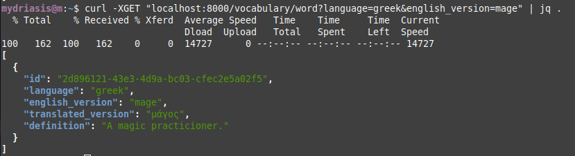
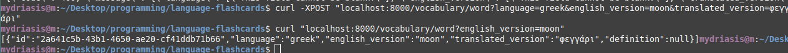
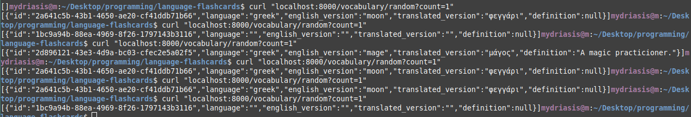

# Bring up the service

Step 1. Make and `source` a virtual environment, python 3.6+ would be great

Step 2. Do this:

```
$ set -a
$ source .env
$ docker-compose build
$ docker-compose up
```
I haven't added the part where you don't have to migrate it all by yourself.
We will get there. For now, you should:

```
$ docker exec -it language-flashcards_django_1 /bin/bash
# ./manage.py migrate
```

Before trying to use the service.
Also, it doesn't come with data yet. That's on you. Once it is up and migrated, you can post new words to the API with `curl`:

```
curl -XPOST "localhost:8000/vocabulary/word?language=greek&english_version=moon&translated_version=φεγγάρι"
```

# Progress...


The first API call! Behold!



Posting a new word, and then getting it back:



Getting random words. Ignore the blank one, I accidentally added it before I added the validation step. Yikes.




# Immediate TODOs:

- Automatic migrations
- Automatic data population